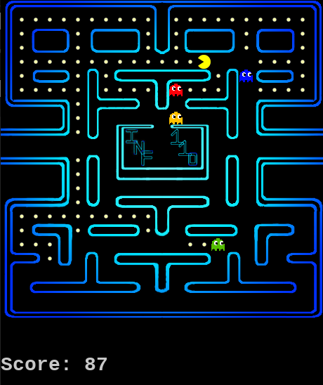
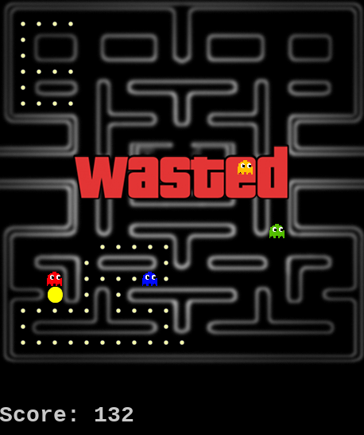

## Pacman Game (C++/Allegro5)

A game developed in the first semester of CS course's "Programming 1" subject at UFV by a group of four students, using C++ and Allegro5 library to clone a Pacman game. 
This is a non-profit project for educational use.

OBS: The source code variables and it's comments language are currently in Portuguese-BR.

## How to run?

Type the following command in your bash, make sure Allegro5 library and Makefile are both installed.
```	
$ make
```
In case of Allegro 5 or Makefile isn't installed yet:

```
$ sudo apt-get install make
$ sudo apt-get install liballegro5-dev
$ sudo apt-get install liballegro5.2
```
## Results:

The result is shown below, with in-game pictures. It also has the background sound, sound effects and a score counter.
<table>
  <tr>
     <td>Gameplay scene</td>
     <td>Game over screen</td>
  </tr>
  <tr>
    <td></td>
    <td></td>
  </tr>
 </table>

## Conclusions

This game was the first college work made in a group, it was very challenging to combine our thoughts and the result was very pleasant. 
Also, every teammate found it very fun to develop this game.

## Credits:

Federal University of Viçosa (College)

- Gabriel Félix (github.com/geflx)
- Matheus Lima (github.com/MatheusAL)
- Lucas Campos (github.com/lucamps)
- Lucas Reis (github.com/lucas-t-reis)
- André Gustavo dos Santos (Teacher)

